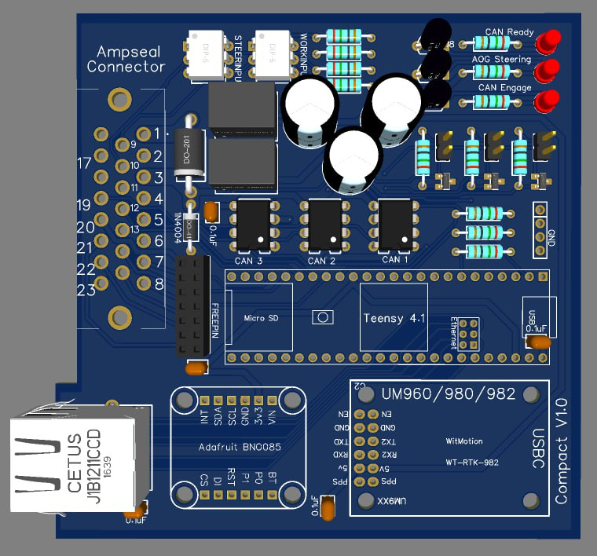
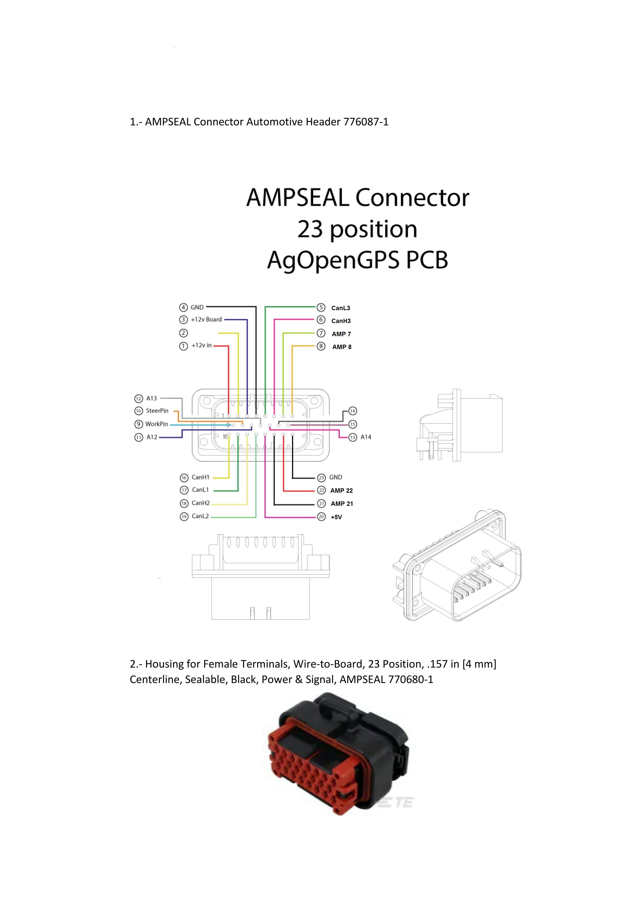

# PCB_Triple_CAN
 PCB Triple CAN for AgOpenGPS

This PCB is an adaptation of the Triple CAN PCB from MechanicTony by AgOpenGPS.

It remains as simple however here is the list of changes:
 _Format 10*10cm
 _Removal of USB sockets
 _Added Ampseal socket
 _Slot for Receive GNSS UM9xx with dedicated power supply.
 _Activation of Steer and Work by GND

# Hardware

Here is the diagram of the AMPSEAL socket and its connection

